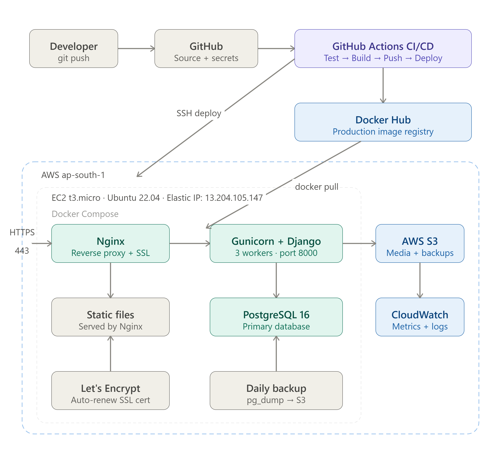

# Developer Portfolio CMS

A production-ready Content Management System for managing a developer portfolio, built with Django, Docker, PostgreSQL, and deployed on AWS using Terraform and GitHub Actions CI/CD.

**Live:** [mihisara.online](https://mihisara.online)

---

## Overview

This project is not just a portfolio website — it is a complete CMS where all content is managed through a custom admin dashboard. No manual HTML editing is ever required.

**Visitors can:**

- View projects, skills, certificates, work experience, and education
- Read blog articles
- Download the latest resume
- Send contact messages

**The administrator can:**

- Manage all portfolio content through a custom dashboard
- Write and publish blog posts with a Markdown editor
- Upload certificates, project screenshots, and profile pictures
- Read and manage contact messages

---

## Architecture

**Full infrastructure diagram:**



---

## Tech Stack

### Backend

| Technology | Purpose |
|---|---|
| Django 5.0 | Web framework |
| Django REST Framework | REST API layer |
| PostgreSQL 16 | Primary database |
| Gunicorn | WSGI production server |
| WhiteNoise | Static file serving |

### Frontend

| Technology | Purpose |
|---|---|
| HTML + CSS + JavaScript | Core frontend |
| Tailwind CSS | Utility-first styling |
| Font Awesome | Icons |

### Infrastructure & DevOps

| Technology | Purpose |
|---|---|
| Docker + Docker Compose | Containerization |
| Nginx | Reverse proxy + SSL termination |
| AWS EC2 (t3.micro) | Application hosting |
| AWS S3 | Media file storage |
| AWS IAM | Access control |
| AWS CloudWatch | Metrics and log monitoring |
| Terraform | Infrastructure as Code |
| GitHub Actions | CI/CD automation |
| Let's Encrypt + Certbot | Free SSL certificates |

---

## Project Structure

```text
dev-portfolio-cms/
├── backend/
│   ├── apps/
│   │   ├── accounts/       # Authentication + user profile
│   │   ├── portfolio/      # Projects, skills, certificates, experience
│   │   ├── blog/           # Blog posts, categories, tags
│   │   ├── contact/        # Contact form messages
│   │   ├── dashboard/      # Custom CMS admin dashboard
│   │   ├── api/            # Django REST Framework API layer
│   │   ├── public/         # Public-facing frontend views
│   │   └── core/           # Shared base models, middleware, utilities
│   ├── config/
│   │   └── settings/
│   │       ├── base.py         # Shared settings
│   │       ├── development.py  # Dev overrides
│   │       └── production.py   # Production hardened settings
│   ├── templates/
│   │   ├── public/         # Portfolio website templates
│   │   └── dashboard/      # CMS dashboard templates
│   ├── requirements/
│   │   ├── base.txt
│   │   ├── development.txt
│   │   └── production.txt
│   ├── entrypoint.sh       # Container startup script
│   └── gunicorn.conf.py    # Gunicorn production config
├── nginx/
│   ├── nginx.conf
│   └── conf.d/
│       └── default.conf    # Nginx + SSL configuration
├── terraform/
│   ├── environments/
│   │   └── production/     # Production Terraform config
│   └── modules/
│       ├── vpc/            # VPC, subnet, IGW, route tables
│       ├── ec2/            # EC2 instance, security groups, EIP
│       ├── s3/             # Media storage bucket
│       └── iam/            # EC2 IAM role and policies
├── .github/
│   └── workflows/
│       ├── ci.yml          # Test + build + push to Docker Hub
│       └── cd.yml          # Deploy to EC2
├── docker-compose.yml      # Development environment
├── docker-compose.prod.yml # Production environment
├── Dockerfile              # Multi-stage build
└── Makefile                # Developer shortcuts
```

---

## CI/CD Pipeline

```text
git push origin main
        │
        ▼
┌─────────────────────────────────────┐
│ CI Workflow                         │
│ 1. Spin up PostgreSQL service       │
│ 2. Install Python dependencies      │
│ 3. Run 34 automated tests           │
│ 4. Build production Docker image    │
│ 5. Push to Docker Hub               │
└──────────────────┬──────────────────┘
                   │ (on success)
                   ▼
┌─────────────────────────────────────┐
│ CD Workflow                         │
│ 1. SSH into EC2                     │
│ 2. Write .env.production            │
│    from GitHub Secrets              │
│ 3. Copy Nginx config                │
│ 4. docker pull latest image         │
│ 5. docker compose up -d             │
│ 6. Verify /health/ endpoint         │
└──────────────────┬──────────────────┘
                   │
                   ▼
           Live in ~4 minutes
```

---

## Security

- **HTTPS** with Let's Encrypt SSL — auto-renewed via cron
- **HSTS** — browsers forced to use HTTPS for 1 year
- **Security headers** — X-Frame-Options, CSP, X-Content-Type-Options, Referrer-Policy
- **CSRF protection** — Django middleware + trusted origins
- **Rate limiting** — contact API endpoint limited to 5 requests/hour per IP
- **File upload validation** — magic byte verification on all uploads
- **Non-root Docker containers** — production container runs as `appuser`
- **IAM least privilege** — EC2 role has access only to its own S3 bucket
- **Secrets management** — all secrets in GitHub Secrets, never in code
- **SQL injection protection** — Django ORM parameterized queries
- **XSS protection** — Django template auto-escaping + CSP header

**Ratings:**

- **SSL:** A ([ssllabs.com](https://www.ssllabs.com/ssltest/analyze.html?d=mihisara.online))
- **Security Headers:** A ([securityheaders.com](https://securityheaders.com/?q=https%3A%2F%2Fmihisara.online&followRedirects=on))

---

## Infrastructure as Code

All AWS infrastructure is provisioned with Terraform:

```bash
cd terraform/environments/production
terraform init
terraform plan
terraform apply
```

**Resources created:**

- VPC with public subnet, Internet Gateway, route table
- EC2 t3.micro instance (Ubuntu 22.04, 20GB gp3 EBS)
- Elastic IP (static public IP)
- Security group (ports 80, 443, 22)
- IAM role with S3 + CloudWatch + SSM permissions
- S3 bucket (versioning, encryption, lifecycle policy)

**State** is stored in S3 with DynamoDB locking.

---

## Local Development Setup

### Prerequisites

- Docker and Docker Compose
- Git

### Setup

```bash
# Clone the repository
git clone https://github.com/mihisara-koralage/dev-portfolio-cms.git
cd dev-portfolio-cms

# Create environment file
cp .env.example .env
# Edit .env with your local values

# Build and start
make build
make upd
make migrate
make createsuperuser
```

Then visit:

- Site: <http://localhost:8000>
- Dashboard: <http://localhost:8000/dashboard/>

### Common Commands

```bash
make upd              # Start development environment
make down             # Stop development environment
make logs             # View container logs
make test             # Run test suite
make shell            # Django shell
make makemigrations   # Create new migrations
make migrate          # Apply migrations
```

---

## API Documentation

Interactive API documentation is available at:

- Swagger UI: <https://mihisara.online/api/docs/>
- ReDoc: <https://mihisara.online/api/redoc/>
- Raw OpenAPI schema: <https://mihisara.online/api/schema/>

### Public Endpoints

```http
GET  /api/profile/                 # Site owner profile
GET  /api/projects/                # Project listing (paginated)
GET  /api/projects/{slug}/         # Project detail
GET  /api/projects/featured/       # Featured projects
GET  /api/skills/categories/       # Skills grouped by category
GET  /api/skills/                  # All skills
GET  /api/certificates/            # Certificates
GET  /api/experience/              # Work experience
GET  /api/education/               # Education
GET  /api/blog/posts/              # Published blog posts
GET  /api/blog/posts/{slug}/       # Blog post detail
POST /api/contact/                 # Submit contact message
```

---

## Testing

```bash
make test
```

Example output:

```text
Found 34 test(s).
Ran 34 tests in 0.970s
OK
```

**Coverage:**

- Model behavior (UUID PKs, timestamps, computed properties)
- Blog post publish workflow (`published_at` auto-set)
- API endpoint validation (contact form field rules)
- API response shapes (pagination structure)
- HTTP method restrictions

---

## Deployment

### Prerequisites

- AWS account with IAM user
- Docker Hub account
- Domain name

### One-time infrastructure setup

```bash
# Configure AWS CLI
aws configure

# Provision infrastructure
cd terraform/environments/production
terraform init
terraform apply
```

Note the outputs:

```text
ec2_public_ip = "x.x.x.x"
ssh_command   = "ssh -i ~/.ssh/portfolio-cms-key.pem ubuntu@x.x.x.x"
```

### Ongoing deployment

```bash
# Just push to main — CI/CD handles everything
git push origin main
```

---

## Monitoring

- **CloudWatch Metrics** — CPU, memory, disk usage collected every 60s
- **CloudWatch Logs** — Docker container logs streamed to AWS
- **CloudWatch Alarms** — alerts on CPU > 80% and disk > 85%
- **Health endpoint** — `GET /health/` returns database connectivity status
- **Auto-renewal** — SSL certificate renewed automatically before expiry

---

## Author

**Mihisara**  
Software Engineering undergraduate — University of Sri Jayewardenepura

- Website: [mihisara.online](https://mihisara.online)
- GitHub: [github.com/mihisara-koralage](https://github.com/mihisara-koralage)
- LinkedIn: [linkedin.com/in/mihisara-koralage](https://www.linkedin.com/in/mihisara-koralage-06b739313/)

---

## License

MIT License — see the [LICENSE](LICENSE) file for details.